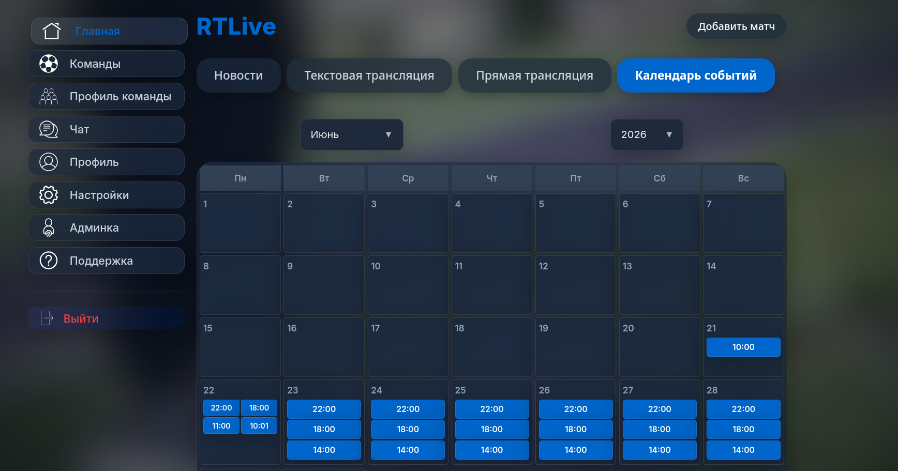
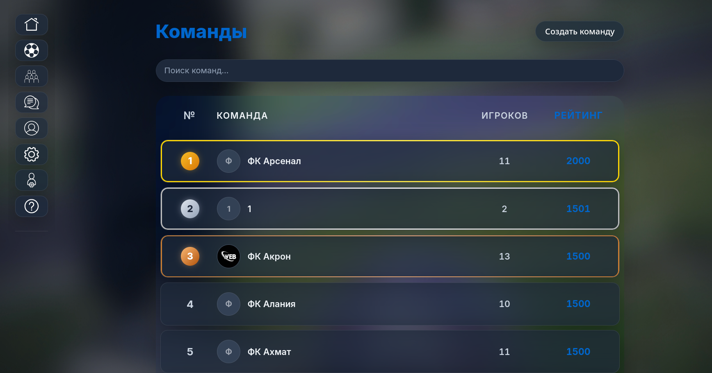
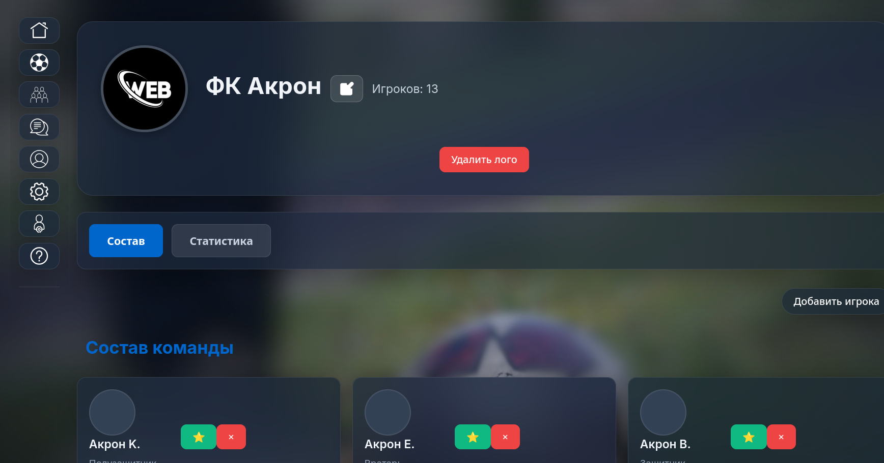
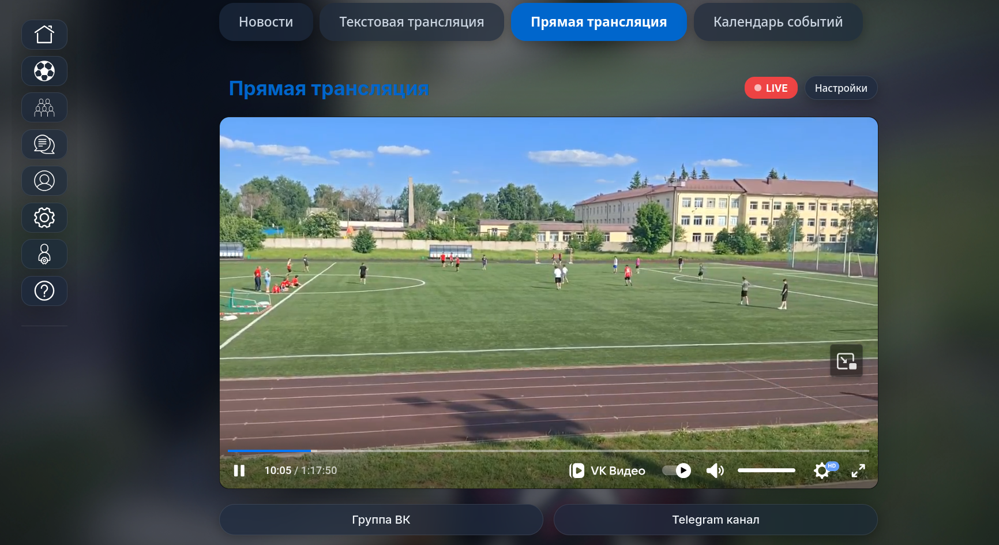

<!-- Header with Animated Typing -->

  

---

  
  
  
  
  

  
  
  

---

## О проекте

**RTLive** — это современная веб-платформа для футбольных команд с возможностью управления составами, статистикой и прямыми трансляциями матчей.

Платформа предоставляет полный инструментарий для организации футбольных соревнований: от создания команд и управления игроками до проведения прямых трансляций матчей и автоматического расчёта рейтингов.

---

## Ключевые возможности

<table>
  <tr>
    <td align="center" width="25%">
      
       <b>Управление командами</b>
       <small>Создание и редактирование футбольных команд</small>
    </td>
    <td align="center" width="25%">
      
       <b>Составы игроков</b>
       <small>Добавление игроков, назначение капитанов</small>
    </td>
    <td align="center" width="25%">
      
       <b>Рейтинги</b>
       <small>Автоматический расчёт рейтинга команд</small>
    </td>
    <td align="center" width="25%">
      
       <b>Трансляции</b>
       <small>Интеграция с VK Video для трансляций</small>
    </td>
  </tr>
  <tr>
    <td align="center" width="25%">
      
       <b>Чат</b>
       <small>Встроенная система сообщений</small>
    </td>
    <td align="center" width="25%">
      
       <b>Поддержка</b>
       <small>Система тикетов и помощи</small>
    </td>
    <td align="center" width="25%">
      
       <b>Дизайн</b>
       <small>Неоновые эффекты и glassmorphism</small>
    </td>
    <td align="center" width="25%">
      
       <b>Адаптивность</b>
       <small>Работает на всех устройствах</small>
    </td>
  </tr>
</table>

---

## Скриншоты

  
  
  
  

---

## Технологии

### Frontend Development

  
  
  
  
  
  
  

### Backend Development

  
  
  
  

### DevOps & Tools

  
  
  
  
  

---

## Авторы

<table>
  <tr>
    <td align="center">
      
       
      <b>Vladislav (Cyber-bober)</b>
       
      <small>Fullstack Developer</small>
       
      
    </td>
    <td align="center">
      
       
      <b>DanisimoQ2</b>
       
      <small>Frontend Developer</small>
       
      
    </td>
  </tr>
</table>

---

## Лицензия

Этот проект распространяется под лицензией **Apache License 2.0**. 

Подробнее см. файл [LICENSE](LICENSE).

---

## Ссылки

- [GitHub репозиторий](https://github.com/Cyber-bober/Fullstack-website)
- [Сообщить об ошибке](https://github.com/Cyber-bober/Fullstack-website/issues)
- [Запрос функции](https://github.com/Cyber-bober/Fullstack-website/issues)

---

  <b>RTLive — современная платформа для футбольных сообществ</b>

  
  
  

